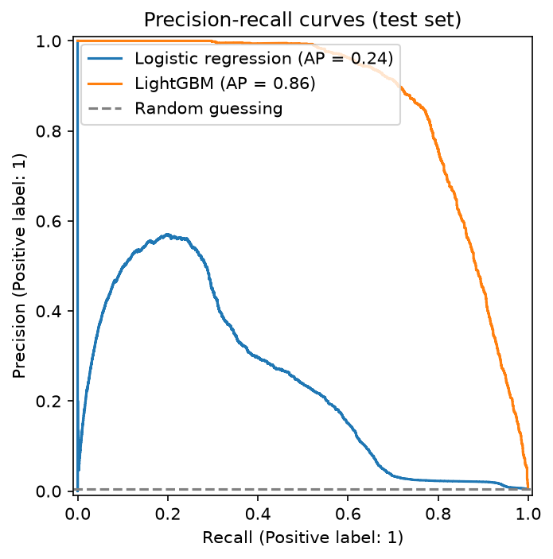
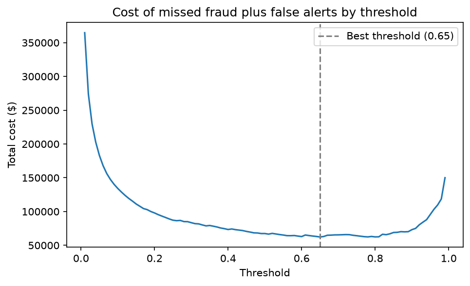
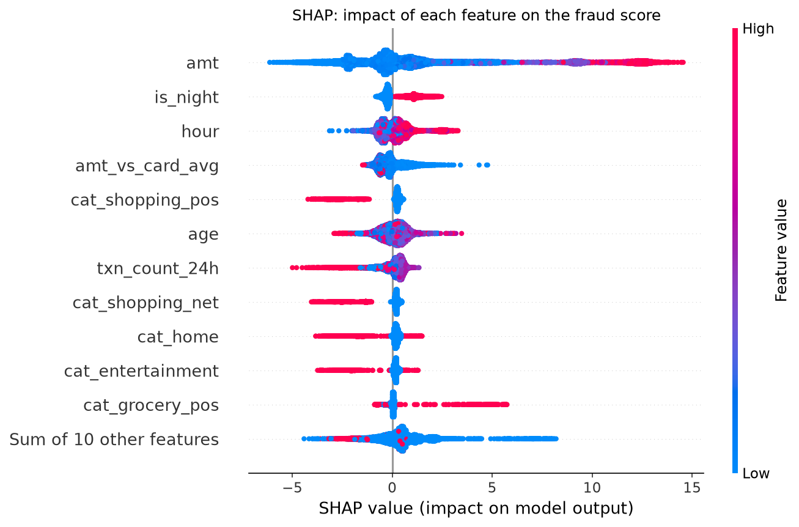
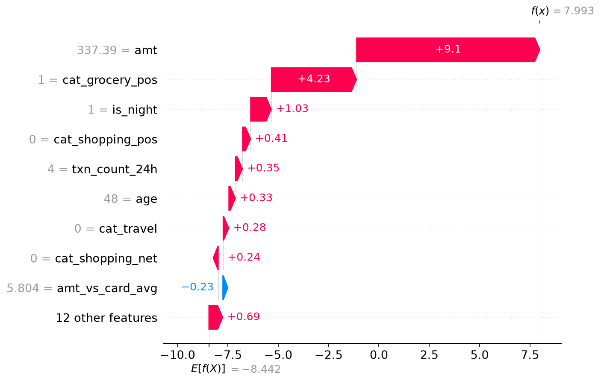

# Credit Card Fraud Detection

A fraud detection model built on 1.85M simulated card transactions, going from exploratory analysis through to a tuned LightGBM model with SHAP explanations.

Fraud is only 0.58% of transactions, so the project focuses on precision and recall rather than accuracy, and on choosing a decision threshold based on the cost to a bank rather than the default 0.5.

## Results

| Model | PR-AUC | Precision | Recall | False alerts per fraud caught |
|---|---|---|---|---|
| Random guessing | 0.004 | – | – | – |
| Logistic regression (baseline, 0.5 threshold) | 0.239 | 2.1% | 87.9% | 46 |
| LightGBM (0.65 threshold) | **0.862** | **36.4%** | **92.0%** | **1.74** |

- With no model, $1.13m of fraud would be missed in the test period. At the chosen threshold, the total cost of missed fraud plus false alerts falls to $62,312, a reduction of around 95%.
- All results are on the test set (Jun–Dec 2020), which the models never saw during training.



## Data

[Credit Card Transactions Fraud Detection Dataset](https://www.kaggle.com/datasets/kartik2112/fraud-detection) (Kaggle, simulated with Sparkov). Train covers Jan 2019 to Jun 2020 and test covers Jun to Dec 2020, so the models are trained on the past and tested on the future, the same way a bank would use them.

I chose this over the classic Kaggle credit card dataset because that one hides its features behind anonymous PCA columns, which would make the SHAP explanations meaningless.

The data isn't included in the repo. Download it and put `fraudTrain.csv` and `fraudTest.csv` in a `data/` folder.

## Approach

| File | Step |
|---|---|
| `01_eda.py` | Exploratory data analysis: class imbalance, amount, category, hour and age |
| `02_features.py` | Feature engineering: night-time flag, age, amount compared to the card's average, transactions in the last 24 hours, one-hot encoded categories |
| `03_baseline.py` | Logistic regression baseline |
| `04_lightgbm.py` | LightGBM with early stopping on a time-based validation set, plus a fairness check on age |
| `05_threshold_shap.py` | Cost-based threshold tuning and SHAP explanations |

Each file has my findings written under the code that produced them.

## Key findings

**EDA.** Fraud clusters into distinct amount bands, with a $10–25 band consistent with card testing and most fraud between $250 and $1,100. Fraud rates vary around 11x by merchant category and are around 25x higher overnight than during the day.

**Features.** The night-time flag and comparing each transaction to the card's own average spend were the strongest engineered features. Distance between the cardholder and the merchant showed no difference between fraud and legitimate transactions, so it was dropped.

**Baseline vs LightGBM.** Logistic regression scored 0.931 ROC-AUC but only 0.239 PR-AUC, which shows how misleading ROC-AUC can be when fraud is this rare. As a linear model, it couldn't learn the amount bands, so it gave its highest scores to the largest transactions, which were legitimate. LightGBM's trees can learn these patterns, which took PR-AUC to 0.862.

**Threshold.** Assuming a false alert costs $10 and missed fraud costs the transaction amount, the best threshold is 0.65. The best threshold moves from 0.49 to 0.94 as the false alert cost goes from $5 to $50, so the threshold is as much a business decision as a technical one.



**Explainability.** SHAP shows amount and the night-time flag are the biggest drivers. Some effects go against the raw fraud rates from the EDA, for example online shopping lowers the fraud score once the amount is known, because SHAP shows each feature's effect after the others are taken into account.



For a single flagged fraud, a $337 grocery transaction at 1am, the amount, the grocery category and the night-time flag pushed the score to almost 1.



## Fairness

Gender was left out as it is a protected characteristic. Age was tested by training the model with and without it. Removing age dropped PR-AUC from 0.862 to 0.803, and the model with age flagged older customers the least, so age was kept in. The trade-off is that younger customers get more false alerts relative to their fraud rate, which a bank would need to monitor.

## Limitations

- The data is simulated, so some patterns are cleaner than real fraud, like the sharp amount bands and fraud switching on at exactly 22:00.
- The test period has less fraud than the training period (0.39% vs 0.58%), which shows fraud levels shift over time. In production the model would need monitoring for drift and regular retraining.
- The $10 false alert cost is an assumption, which is why the sensitivity check is included.

## How to run

```bash
python3 -m venv .venv && source .venv/bin/activate
pip install -r requirements.txt
```

Then run the files in order, `01` to `05`. Each file uses `# %%` cells, so it can be run cell by cell in VS Code.
